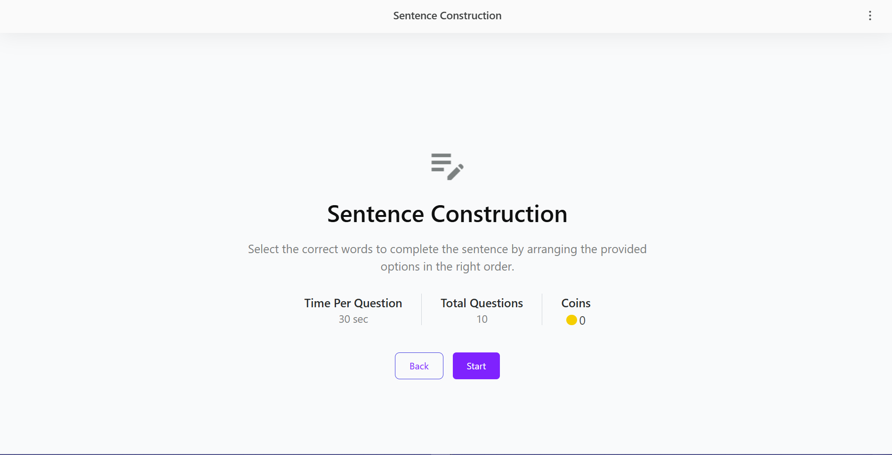
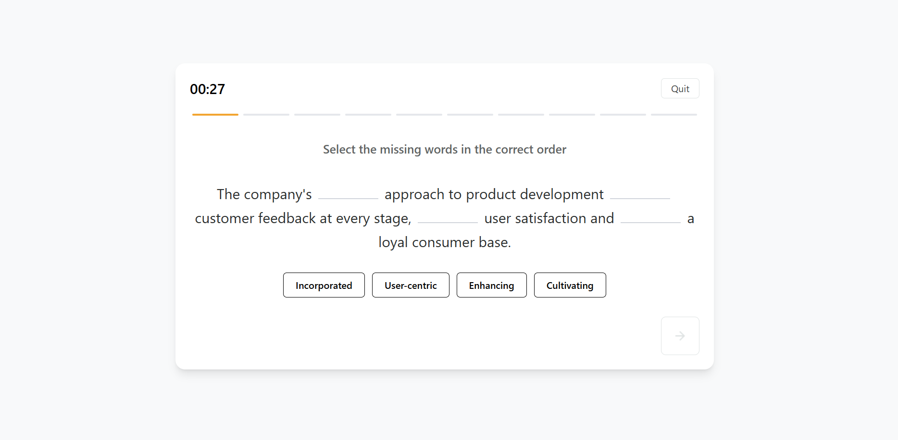
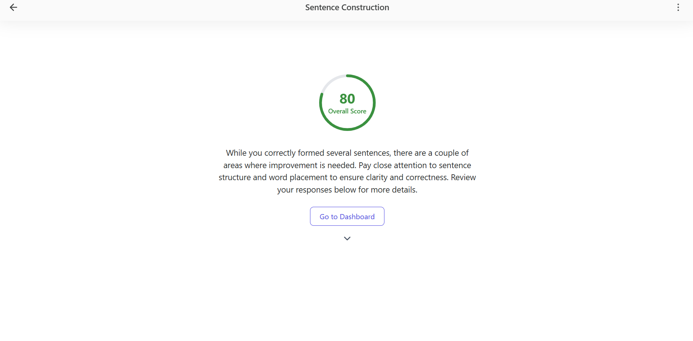
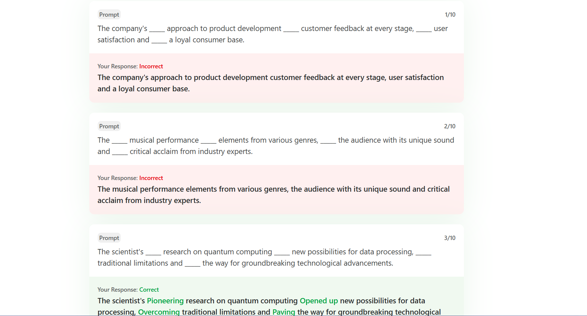

# 📝 Sentence Construction Tool

A React-based quiz application where users complete sentence construction questions by selecting the correct words in the correct order. It includes a timer, score calculation, responsive design, and answer review at the end.

---

## 🚀 Features

- 📝 Interactive sentence completion questions
- ⏱️ 30-second timer for each question
- 🔁 Auto-navigation after timer ends
- 🔍 Word selection and unselection support
- ✅ Final result with correctness feedback
- 📊 Score loader animation
- 🔄 Fully responsive UI
- 🗂 Modular file structure
- 🌐 Backend API with JSON Server

---

## 📸 Screenshots

### 🏠 Home Page



### 🧩 Quiz Page



### 🏁 Result Page



### 💬 Feedback Page



---

## 🛠️ Tech Stack

- **Frontend:** React.js, TailwindCSS, React Router
- **State Management:** useState, useEffect
- **Backend:** JSON Server (hosted on Render)
- **Deployment:** Frontend on Vercel, Backend on Render

## 🚧 How to Run Locally

### ▶️ Frontend

```bash
git clone https://github.com/your-username/Sentence-Construction-Tool.git
cd Sentence-Construction-Tool
npm install
npm start
```

### 🗄️ Backend

````bash
npm install -g json-server


## To start the mock backend server:
npm run server
````
